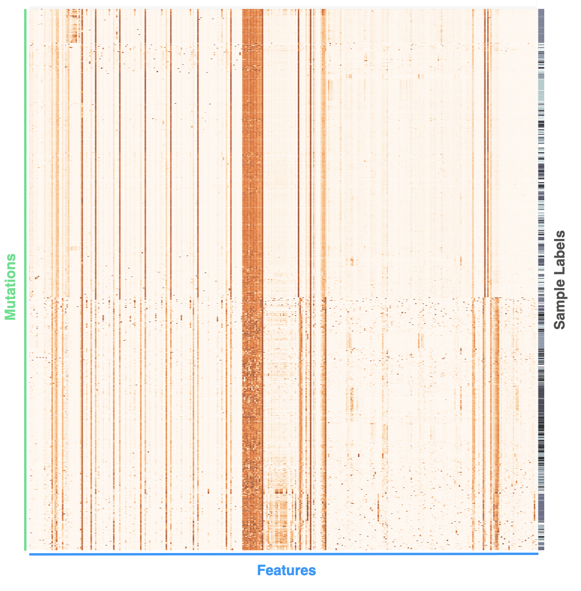

_Installation and usage instructions can be found in the [wiki](https://github.com/Wittelab/orchid/wiki)._

# orchid
A management, annotation, and machine learning system for analyzing cancer mutations.  
   

# Introduction

Please refer to the following publication for a detailed description of the software:  
Bioinformatics, btx709, [https://doi.org/10.1093/bioinformatics/btx709](https://doi.org/10.1093/bioinformatics/btx709)
  
   

_What is orchid?_ 

The objective of orchid is to enable meaningful biological and clinical insights from tumor genetic data though the use of machine learning. For example, orchid could be used to classify aggressive vs. non-aggressive prostate cancer or determine the tissue-of-origin from the cell-free DNA molecules of a patient with cancer.
  
   

_What is a 'tumor mutational profile'?_

In the orchid framework, we define a _tumor mutational profile_ as the annotated set of mutations within a tumor. A typical tumor might contain thousands of mutations. Most are presumed to be irrelevant to disease because they arise due to an important hallmark of cancer-- an unstable genome. However, a crucial subset of these mutations is considered fundamental to carcinogenesis, or at least significantly involved, making them potential biomarkers for clinical classification (e.g. tumor aggressiveness). Orchid adopts a comprehensive approach to variant analysis, employing machine learning algorithms to collectively analyze all mutations. This methodology exposes nuanced mutational patterns and helps tease apart biological complexity.

   

_What is meant by an 'annotated set of mutations'?_
  
An annotation is simply a numeric or ordinal value that can be associated with a particular mutation. For example, 'mutation A' may change the amino acid sequence of a protein, so we can annotate it as a 'non-synonymous single nucleotide polymorphism' or 'nsSNP'. On the other hand, 'mutation B' may not change the amino acid sequence, so we annotate it as a 'synonymous SNP'. Biologically speaking, a non-synonymous SNP is more likely to change the effect of a protein than a synonymous one. In machine learning parlance, an annotation is called a _feature_. If we gather many mutations across a tumor (or tumors) and annotate each mutation with many features, we end up with a set of annotated mutations, or _tumor mutational profile_.

At this time, many regulatory and coding features of the human genome have been extensively cataloged, resulting in a wealth of data to mine. If we gather enough biological data, we can increase our understanding of each individual mutation and its possible role in cancer, or at least begin to see if patterns emerge from the data. A list of features used in our publication and available in our public database can be found here (**Note:** This page is now archived: [web.archive.org](web.archive.org)): [http://wittelab.ucsf.edu/orchid](https://web.archive.org/web/20190109010853/http://wittelab.ucsf.edu/orchid).

Here's an example. If we arrange a set of mutations from a tumor in rows and corresponding feature values in columns, a mutational profile can be created and visualized:  
**NOTE:** You'll immediately see a lot of correlated feature vectors. Before training, its crucial to remove them.  
  

The scale here is white to orange, depending on feature value. There is also a final column of sample labels, which is ultimately what we're interested in learning. 

# Getting Started
1. Download this code and install prerequisites  
2. Obtain tumor and annotation data  
3. Build the database  
4. Perform machine learning  

Please refer to the [wiki](https://github.com/Wittelab/orchid/wiki) to begin! 

_NOTICE:_
_This software requires the use of other code and/or data that must be obtained with respect to its license or copyright. Generally speaking, this implies orchid's use is restricted to non-commercial activities. Orchid itself is licensed under the MIT license requiring only preservation of copyright and license notices. Please see the LICENSE file for more details._
